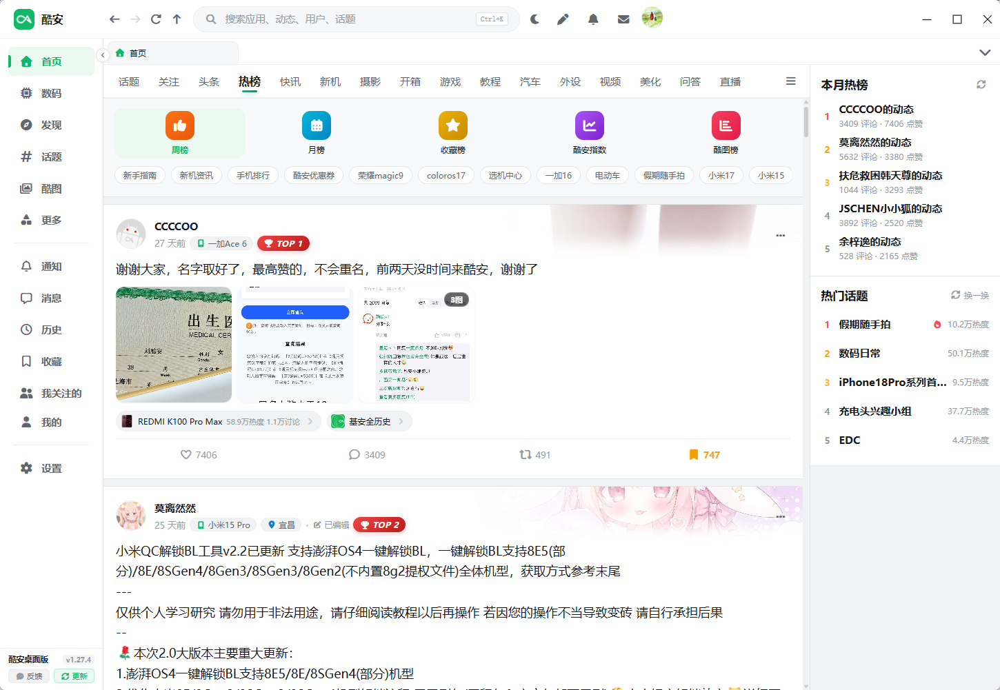
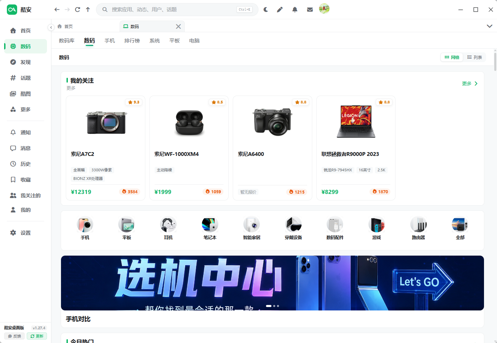
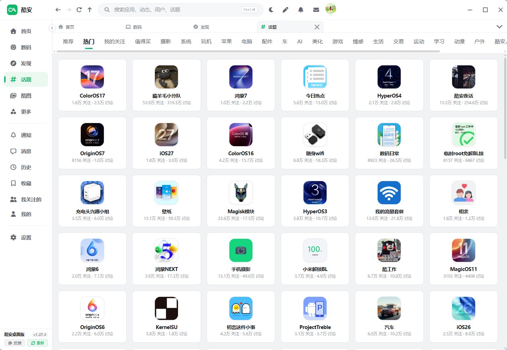
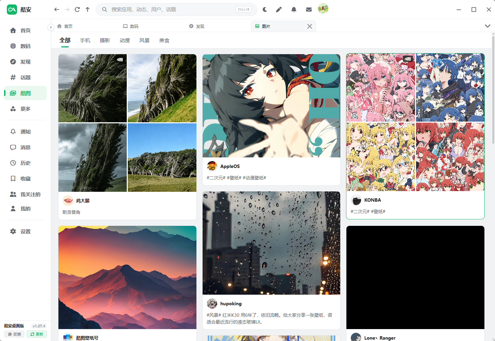
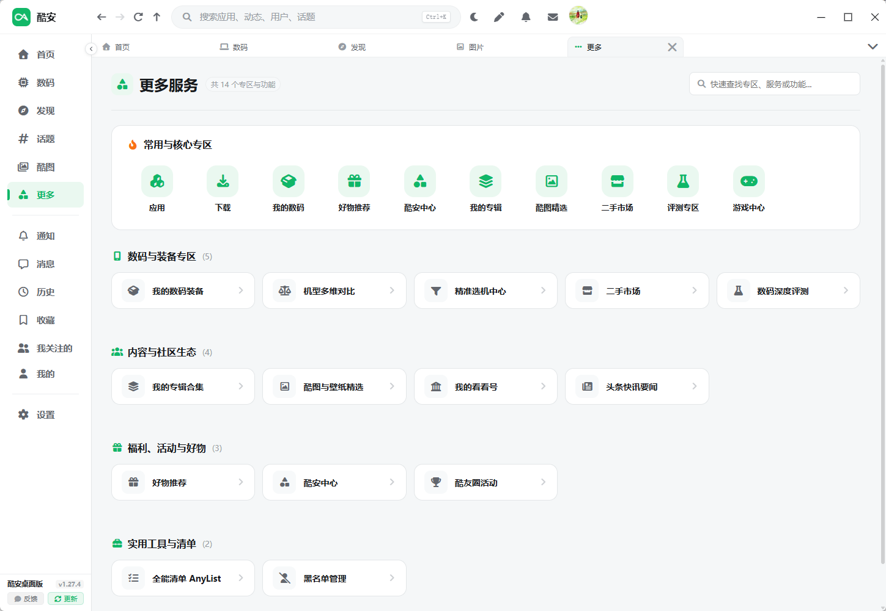
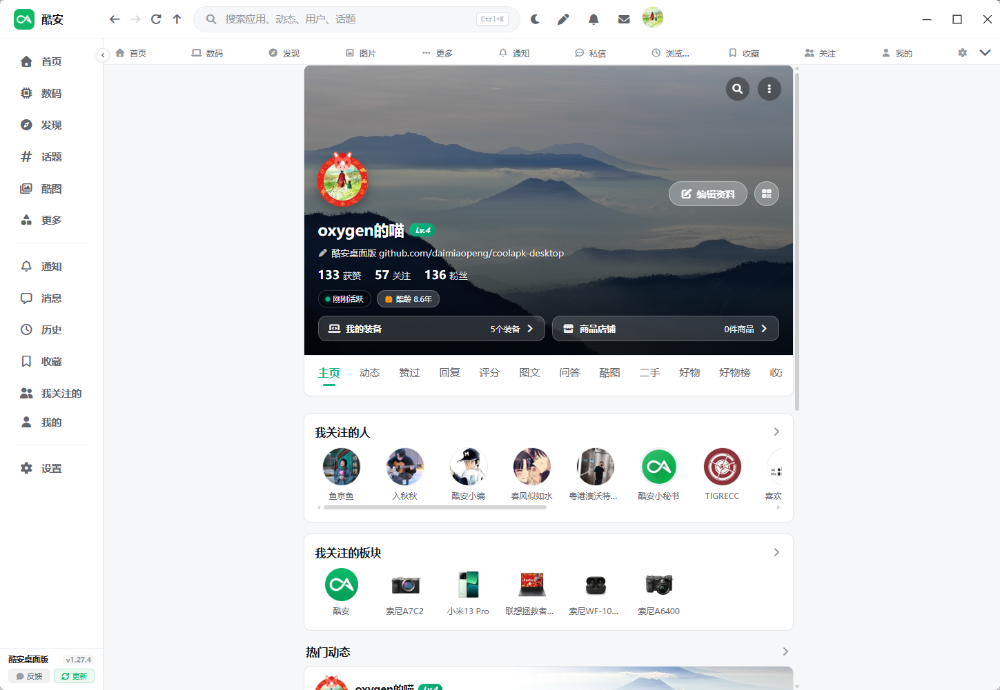
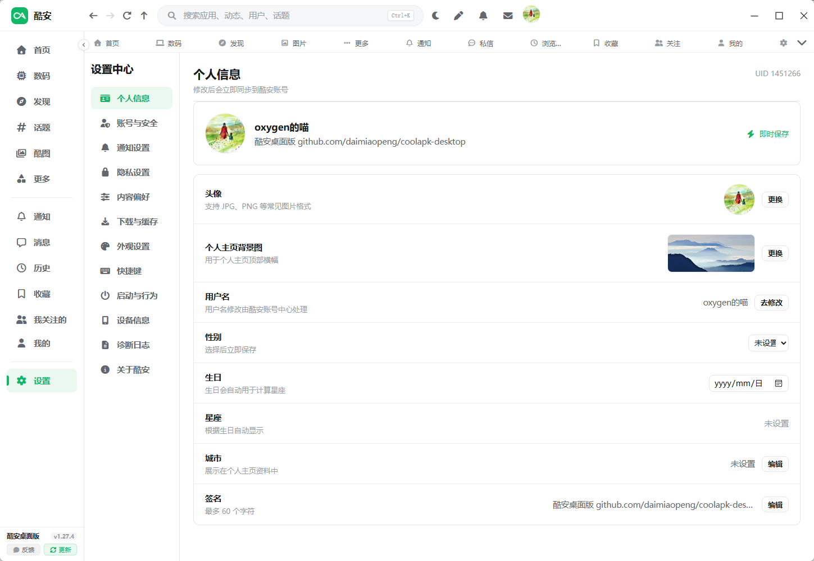

<p align="center">
  
</p>

<h1 align="center">酷安docker版</h1>

<p align="center">基于 Vue 3、TypeScript、Pinia、Vite、Rust / Axum 和 Docker Compose 的第三方酷安 Docker 客户端。</p>

<p align="center">
  <a href="https://github.com/lcmovie">联系与支持</a>
  <a href="LICENSE"></a>
  
</p>

> [!IMPORTANT]
> 本项目是社区维护的第三方 Docker 客户端，与酷安官方及深圳酷安网络科技有限公司无隶属、授权或合作关系。酷安名称、Logo 和相关商标归其权利人所有。

## 酷安docker版

本分支增加原生网页运行方式：复用桌面版 Vue 界面，由独立 Rust HTTP 服务提供接口和持久化数据，不需要图形桌面或 VNC。桌面版仍使用原有 Tauri 运行方式。

支持通过 `docker compose up -d --build` 构建和部署。账号 Cookie、应用访问会话、设置、历史和下载文件保存在安装目录的 `data/`，容器重新创建后继续保留；Cookie 的有效期仍由酷安决定。

项目已迁移到服务器 `203.0.113.10`，安装目录为 `/opt/coolapk-docker`，端口 `18966`，服务继续运行。外网沿用 [酷安docker版](https://coolapk.example.com:88/)，Lucky 目标已切换到新机器。旧 NAS 项目已完成完整备份校验、删除和资源复核，其他服务保持不变。网页访问密码保存在安装目录 `.env` 的 `COOLAPK_ACCESS_PASSWORD` 中。参见 [部署说明](docs/docker-deployment.md)、[验证说明](docs/docker-testing.md) 和 [本轮修复与迁移记录](docs/docker-migration.md)。

酷安 Cookie 由用户在网页自行导入；测试不代用户导入、展示或操作真实凭据。迁移保留已有账号数据并验证存储恢复，真实账号业务操作需要独立授权与验证。桌面 WebView 自动授权不适用于浏览器。

## 本地归档

完整工作目录已归档到 `D:\dev\coolapk`，新的 Git 工作仓库已继承原 `feat/docker-web` 历史，以 `main` 继续维护并保留原标签。原历史 bundle、本地源码快照、NAS 完整资料、新机当前资料及实际运行镜像保存在 `archives/private/`；该目录不进入 Git，并使用 Windows ACL 保护。备份含真实部署配置和账号数据，勿公开或提交。归档内容、恢复步骤及已完成的 NAS 清理见 [本地归档与恢复](docs/archive-2026-09-30.md)，脱敏校验记录保存在 `archives/` 根目录。

## 原项目桌面与移动端产物参考

以下为上游原项目的桌面和移动端产物参考，网页安装以 Docker [部署说明](docs/docker-deployment.md) 为准。原项目程序包位于 [上游 GitHub Releases](https://github.com/daimiaopeng/coolapk-desktop/releases)：

| 操作系统 | 文件格式 | 推荐安装包 |
| :--- | :--- | :--- |
| **Windows 安装版** | `.exe` | `coolapk-desktop_x.x.x_x64-setup.exe` (x64) / `arm64-setup.exe` (ARM64) |
| **Windows 单文件版** | `.exe` | `coolapk-desktop_x.x.x_x64-portable.exe` (x64) / `arm64-portable.exe` (ARM64) |
| **macOS** | `.dmg` / `.app` | `coolapk-desktop_x.x.x_aarch64.dmg` (Apple 芯片) / `x64.dmg` (Intel 芯片) |
| **Linux** | `.AppImage` / `.deb` / `.rpm` | `coolapk-desktop_x.x.x_amd64.AppImage` / `.deb` / `.rpm` |
| **Android** | `.apk` / `.aab` | `coolapk-vx.y.z-android-arm64.apk` / `coolapk-vx.y.z-android-arm64.aab` |
| **iPhone / iPad** | `.ipa` | `coolapk-vx.y.z-ios-arm64-unsigned.ipa`（未签名，需自行签名安装） |

> 💡 **提示**：构建产物均由 GitHub Actions 自动化流程在云端打包。Windows 单文件版无需解压或安装，系统需已有 WebView2 Runtime。iOS IPA 为未签名设备包，不能直接安装到普通 iPhone/iPad，需要使用 AltStore、SideStore、Sideloadly 或自己的 Apple 证书完成签名。

## 界面预览















## 项目来源与支持

感谢原作者 [daimiaopeng](https://github.com/daimiaopeng/coolapk-desktop) 及原项目贡献者。本分支复用原 Vue 界面和 Rust 酷安协议逻辑，增加 Axum HTTP 服务、Docker Compose、服务端持久化和浏览器能力适配。

联系与支持统一使用 [lcmovie 的 GitHub](https://github.com/lcmovie)。GitHub 统计暂时显示为 `0`，不请求原仓库的实时统计。

## 功能

- **首页信息流**：推荐、热榜、快讯、酷图、二手、数码、评测等频道一应俱全
- **动态浏览**：图文详情、评论楼中楼、热门爆评、点赞、收藏、转发查看，体验顺畅
- **浏览历史**：时间轴轨迹记录，支持动态、用户、话题与应用分类即时筛选及右侧常逛侧边栏
- **关注与粉丝**：双列响应式布局，支持查看已关注酷友及粉丝列表、实时动态与全量自动翻页
- **搜索直达**：全站综合搜索涵盖应用、游戏、用户、话题与动态帖子
- **收藏管理**：集成云端收藏与收藏单合集，支持全屏满幅平铺浏览
- **广场中心**：涵盖话题广场、评测区、应用中心与游戏中心
- **私信聊天**：支持文字与图片消息，支持多账号快速切换
- **账号能力**：Cookie 导入（详见 [手动抓取与导入 Cookie 指南](docs/cookie-guide.md)），多账户保存与一键切账号；桌面授权代码保留在原项目运行方式中
- **个性化与布局**：全屏无边距满幅平铺、深浅色主题、侧边栏折叠与默认启动页设置
- **跨平台**：Windows、macOS、Linux 原生桌面应用，以及 Android、iOS 移动端应用

部分功能依赖酷安服务端接口，可能因官方调整、账号权限或风控策略而临时失效。

## 隐私与网络访问

- 项目不内置个人 Cookie、账号 Token、统计 SDK 或遥测服务。
- 登录凭据由用户手动输入，保存到部署安装目录 `data/accounts/` 的账户库，不写入仓库。
- Docker 服务的设备身份、应用访问会话和设置保存在安装目录 `data/`，容器重新创建后恢复。
- Rust 服务请求酷安 API 和媒体，浏览器通过同源服务访问数据；人工验证码按需加载官方 SDK。
- 请勿在 Issue、日志或截图中提交真实 Cookie、私信和其他个人数据。

部署存储与凭据保护参见 [部署说明](docs/docker-deployment.md) 和 [归档保护说明](docs/archive-2026-09-30.md)。

## 开发环境

- Node.js 22 或更高版本
- Rust stable
- 各平台的 [Tauri 2 系统依赖](https://v2.tauri.app/start/prerequisites/)

```bash
git clone https://github.com/daimiaopeng/coolapk-desktop.git
cd coolapk-desktop
npm ci
npm run tauri dev
```

生产构建可按当前平台选择产物格式：

```bash
# Windows：构建 NSIS 安装包；原始 release 可执行文件即单文件版
npm run tauri build -- --bundles nsis
./scripts/prepare-windows-portable.ps1 -Architecture x64

# Linux
npm run tauri build -- --bundles appimage,deb,rpm

# macOS
npm run tauri build -- --bundles app,dmg
```

### Android APK

Android 构建需要 JDK 17+、Android SDK、Platform Tools、Build Tools 和 NDK (Side by side)。Windows 下构建脚本会自动读取 `JAVA_HOME`、`ANDROID_HOME`、`NDK_HOME`，也能识别默认 Android SDK 和本项目使用的 Android OpenJDK 安装位置。

```bash
# 首次生成 Android 工程（生成目录不会提交到 Git）
npm run android:init

# 默认构建 ARM64 debug APK，适用于大多数真机
npm run android:build

# 自定义目标，例如生成全部架构的 debug APK
npm run android:build -- --debug --apk
```

APK 输出到 `src-tauri/gen/android/app/build/outputs/apk/`。连接设备后可用 `adb install -r <apk路径>` 安装。正式分发前还需配置 Android 签名；Google Play 应优先构建并上传 AAB。

Tag 发布时，GitHub Actions 会构建签名的 ARM64 release APK 和 AAB，并上传到同一个 GitHub Release。仓库需要配置以下 Actions Secrets：

- `ANDROID_KEYSTORE_BASE64`：上传密钥 `.jks` 文件的 Base64 内容
- `ANDROID_KEYSTORE_PASSWORD`：密钥库密码
- `ANDROID_KEY_ALIAS`：密钥别名
- `ANDROID_KEY_PASSWORD`：密钥密码

安装包位于 `src-tauri/target/release/bundle/`。GitHub Actions 会提供：

- Windows x64：NSIS 安装包 `-setup.exe`、单文件便携版 `x64-portable.exe`
- Windows ARM64：NSIS 安装包 `-setup.exe`、单文件便携版 `arm64-portable.exe`
- Linux x64：AppImage 免安装版 `.AppImage`、Debian 安装包 `.deb`、RPM 安装包 `.rpm`
- macOS Apple 芯片：磁盘映像 `.dmg`、应用包 `.app`
- macOS Intel：磁盘映像 `.dmg`、应用包 `.app`
- Android ARM64：Release APK `.apk`、Google Play 发布包 `.aab`
- iOS ARM64：未签名 IPA `.ipa`（供第三方工具或用户自行签名）

### iOS IPA

iOS 构建必须在 macOS 上完成，并需要完整的 Xcode、CocoaPods 和 Rust iOS 目标。首次构建前，在 macOS 上执行：

```bash
# 安装 CocoaPods（已安装可跳过）
brew install cocoapods

# 安装 Rust iOS 目标
rustup target add aarch64-apple-ios aarch64-apple-ios-sim x86_64-apple-ios

# 首次生成 iOS 工程
npm run tauri -- ios init

# 使用 Xcode 打开并调试
npm run tauri -- ios dev --open

# 构建设备版未签名 IPA
npm run tauri -- ios build --target aarch64 --no-sign --ci
```

GitHub Actions 会在推送 `v*` 版本标签时自动生成 ARM64 未签名 IPA，并上传到对应的 GitHub Release。该 IPA 不包含 Apple 开发者签名，安装到真机前需要使用 AltStore、SideStore、Sideloadly 或自己的证书重新签名；它不是可直接提交 App Store 的发行包。

## 自动发布

推送以 `v` 开头的版本标签后，GitHub Actions 会自动构建全部平台，并创建公开的 GitHub Release，上传上述安装包。普通的 `main` 分支推送和 Pull Request 只执行构建检查，不会发布版本。

发布前只需更新 `src/constants/version.ts` 并创建对应标签，GitHub Actions 会从标签自动同步版本号到全部构建文件：

```bash
npm run version:set -- 1.2.3
npm run build
git tag v1.2.3
git push origin main v1.2.3
```

Windows 客户端会自动识别当前运行方式：安装版下载同架构的 `-setup.exe` 静默升级，单文件版下载同架构的 `-portable.exe`，退出后原位替换并重启。两种更新包都必须与 Release 标签版本一致，避免装错版本。

## 常用检查

```bash
npm run build
npm audit
cd src-tauri
cargo test
cargo check
```

## 项目结构

```text
src/                         Vue 3 / TypeScript 前端
  api/coolapk.ts             桌面命令与 HTTP 接口适配
web-server/                 Rust / Axum HTTP 服务
Dockerfile、compose.yaml     Docker 镜像和 Compose 部署
  utils/coolapkEmoji.ts      酷安表情映射
src-tauri/                   Rust / Tauri 桌面端
  src/coolapk/auth.rs        Token V3 兼容签名
  src/coolapk/client.rs      API、图片和会话请求
  src/coolapk/commands.rs    Tauri commands
  src/coolapk/api_tests.rs   接口可用性探测测试
docs/screenshots/            界面预览截图
.github/workflows/build.yml  跨平台构建流程
```

## 登录说明

先使用安装目录 `.env` 中配置的应用访问密码打开网页。公开动态、评论和图文可在未登录酷安账号时浏览；酷安仍可能要求人工验证码。

需要账号功能时，在网页右上角登录弹窗导入有效 Cookie。详细提取步骤见 [手动抓取与导入 Cookie 指南](docs/cookie-guide.md)。原桌面 WebView 自动授权窗口不适用于浏览器。

Cookie 保存在部署安装目录 `data/accounts/`，不回传原文给浏览器。Cookie 包含账号操作权限，不能写入代码仓库、公开 Issue、日志或截图；持久化不改变酷安官方有效期。

## 贡献

反馈与支持见 [GitHub](https://github.com/lcmovie)。提交前请运行前端构建、Rust 测试，并确保测试数据不包含真实账号、Cookie、设备标识或私信内容。


## 许可证

代码采用 [MIT 许可证](LICENSE)。第三方品牌、Logo、表情及服务端内容不包含在 MIT 授权范围内，详见 [第三方声明](NOTICE.md)。
